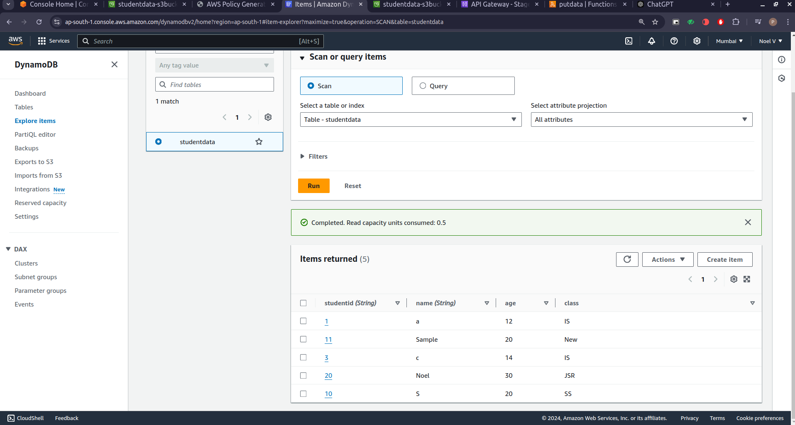
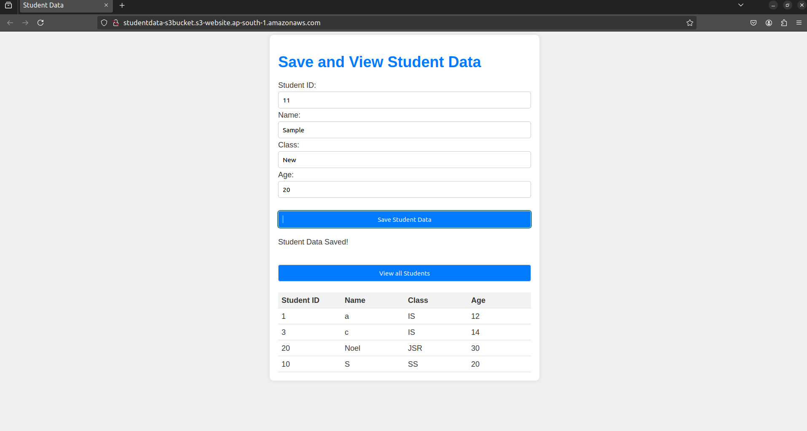
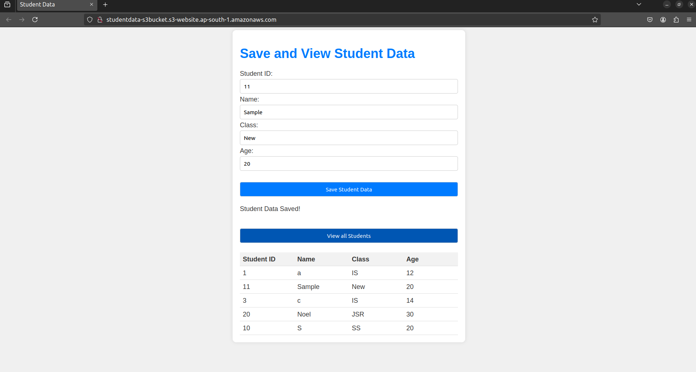
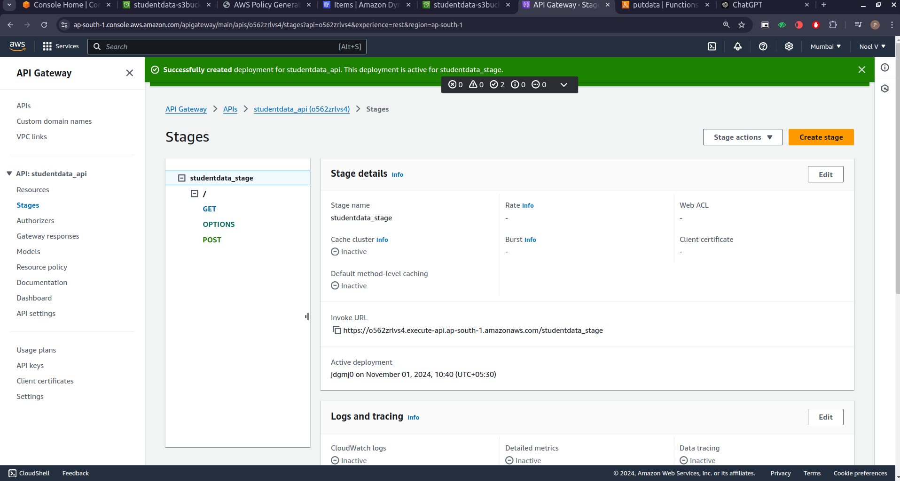
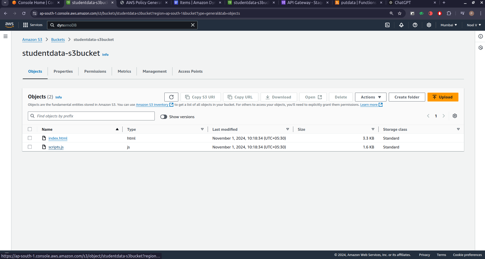
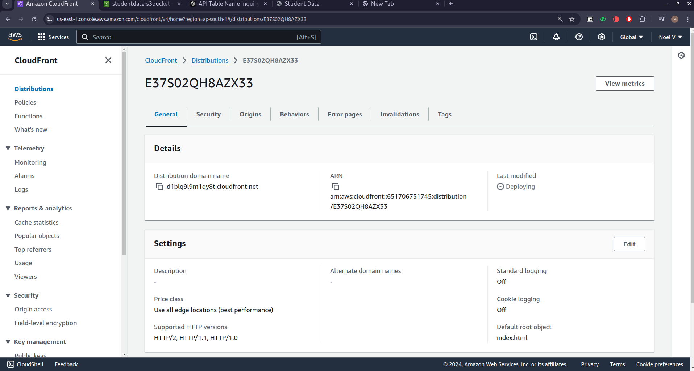
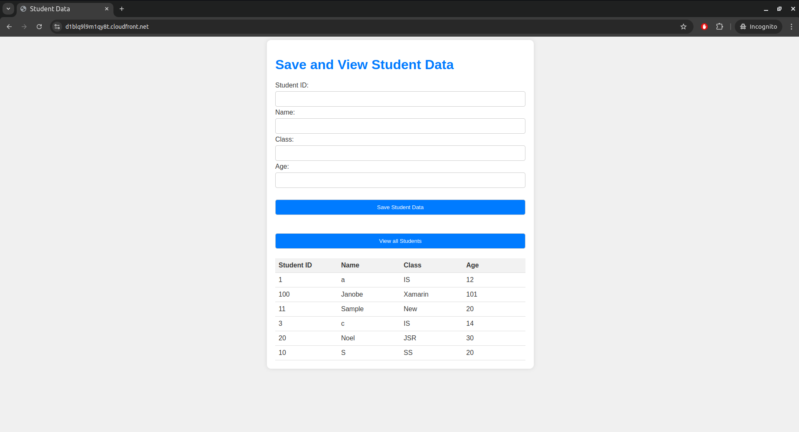

# Serverless Web Application on AWS

This repository hosts the code and architecture for a fully serverless web application on AWS. The application leverages DynamoDB, Lambda, API Gateway, S3, and CloudFront for secure and scalable access.

## Overview
This serverless web application is designed to provide secure, scalable access via HTTPS, leveraging AWS services to handle backend processes, data storage, and API management.

## Architecture
The architecture consists of the following services:
1. **DynamoDB**: Manages data storage with high scalability.
2. **AWS Lambda**: Processes backend logic serverlessly.
3. **API Gateway**: Provides a RESTful API for frontend interactions.
4. **S3 Bucket**: Hosts the static content for the web application.
5. **CloudFront**: Secures content delivery over HTTPS.

Below is a high-level diagram of the architecture.

 

---

## Components

### DynamoDB
DynamoDB serves as the primary data store for the application, providing a fully managed NoSQL database with consistent performance.

**Screenshot of DynamoDB Table Structure:**

 
### AWS Lambda
Lambda functions are used to handle backend processes and are triggered by API Gateway requests. They enable serverless execution of backend logic.

**Screenshot of Lambda Function Configuration:**

**Get Function**

 

**Post Function**

 

### API Gateway
API Gateway facilitates RESTful API endpoints, allowing the frontend to interact with backend Lambda functions.

**Screenshot of API Gateway Setup:**

 

### S3 for Static Content
An S3 bucket hosts the application’s static content, making it accessible globally and reducing server dependency.

**Screenshot of S3 Bucket and Content:**

 

### CloudFront for HTTPS
CloudFront serves the S3-hosted content over HTTPS, ensuring secure access for end-users. It distributes content globally with low latency.

**Screenshot of CloudFront Distribution:**

 

 

---

## Setup Instructions
1. **DynamoDB Setup**: Create a table in DynamoDB with the necessary partition and sort keys based on your data requirements.
2. **Lambda Function Setup**:
   - Create a Lambda function for backend processing.
   - Attach appropriate IAM roles for DynamoDB access.
   - Configure environment variables as required.
3. **API Gateway Setup**:
   - Set up RESTful endpoints and integrate them with the Lambda functions.
   - Configure CORS settings to allow frontend access.
4. **S3 Bucket Setup**:
   - Create an S3 bucket and upload static files.
   - Configure bucket policy to make content publicly readable or accessible via CloudFront.
5. **CloudFront Distribution Setup**:
   - Create a CloudFront distribution and link it to the S3 bucket.
 
---
